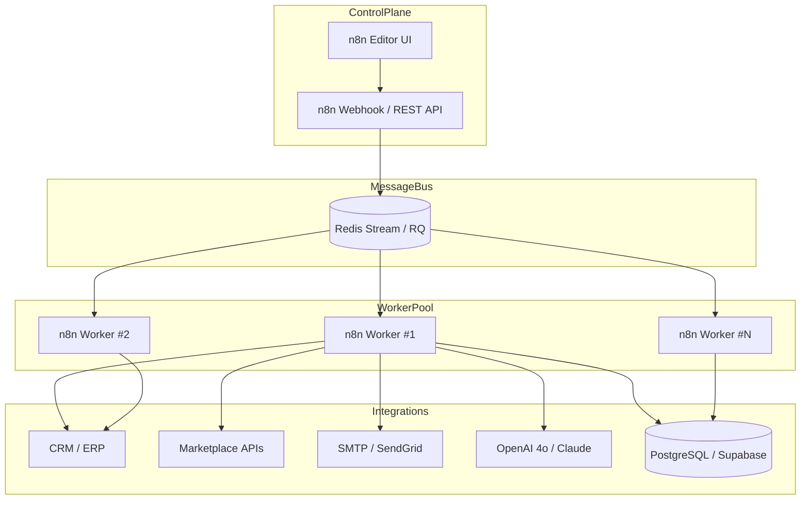
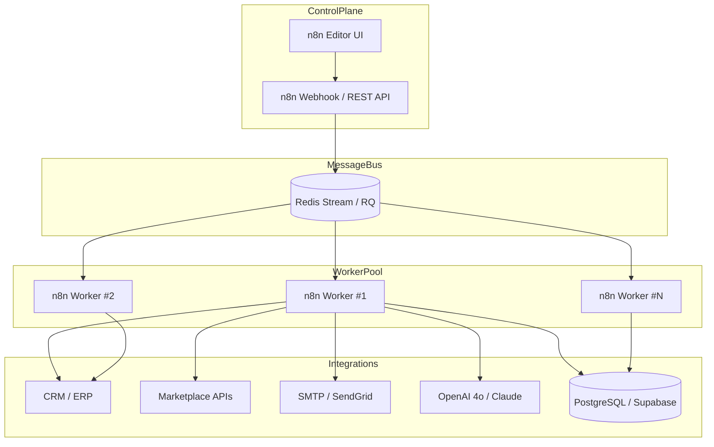
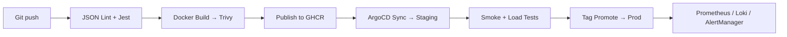

GRG-Automation — центр компетенций внутри GRG Company, где мы превращаем хаотичные ручные операции клиентов в воспроизводимые сценарии, описанные языком workflow-диаграмм и свёрнутые в контейнеры, способные пережить любые пиковые нагрузки. Наш фокус — n8n и Make (ex-Integromat) как ядро iPaaS-платформы, дополняемое кастомными Node.js-микросервисами, Supabase Edge Functions и очередями Redis RQ. Мы строим строго событийные ландшафты: любые веб-хуки, CRON-триггеры или сообщения Kafka/NATS попадают в единый Redis-стрим, откуда горизонтально масштабируемый пул воркеров подхватывает их, оборачивает в идемпотентные транзакции и, при необходимости, откатывает шаги, гарантируя целостность данных и SLA 99,9 %.

Каждый workflow хранится как код: JSON-манифест лежит в Git-репозитории рядом с unit-тестами для кастомных нод на Jest. GitHub Actions после каждого push’a прогоняет линтер схем, CodeQL для TypeScript-части, Trivy-сканирование образов и запускает интеграционные тесты в изолированном namespace Kubernetes. ArgoCD через GitOps-паттерн раскатывает изменения сперва в staging, где ворклоу получают нагрузку synthetic-данными, и лишь после зелёного отчёта промотирует tag в production. Среднее время доставки фичи с момента merge — меньше тридцати минут, а откат до предыдущего релиза занимает около пятидесяти секунд.

```mermaid
%% CI/CD for Automation Blueprints
flowchart LR
    commit[Git&nbsp;push] --> check[JSON&nbsp;Lint&nbsp;+&nbsp;Jest]
    check   --> build[Docker&nbsp;Build&nbsp;→&nbsp;Trivy]
    build   --> push[Publish&nbsp;to&nbsp;GHCR]
    push    --> deploy[ArgoCD&nbsp;Sync&nbsp;→&nbsp;Staging]
    deploy  --> qa[Smoke&nbsp;+&nbsp;Load&nbsp;Tests]
    qa      --> promote[Tag&nbsp;Promote&nbsp;→&nbsp;Prod]
    promote --> observe[Prometheus&nbsp;/&nbsp;Loki&nbsp;/&nbsp;AlertManager]
```

Мы намеренно избегаем «волшебных» no-code-конструкторов без возможности версионирования: весь стек описан декларативно — от Helm-чарта кластера n8n до Kustomize-оверлеев под разные облака (AWS EKS, VK Cloud, bare-metal). Такая прозрачность позволяет воспроизводить окружения по кнопке и доказывать аудиторам соответствие требованиям GDPR и российского 152-ФЗ.

Портфолио GRG-Automation включает более ста запущенных сценариев, среди которых — real-time «ценовой радар» для маркетплейсов Wildberries/Ozon, синхронизация сделок между Bitrix24 и 1С УНФ с автопривязкой UTM-меток, on-ramp Web3-касса через кошелёк Tonkeeper и AI-агент по предиктивному скорингу лидов, который ежедневно обрабатывает до пяти тысяч заявок и передаёт в CRM только тех, чья вероятность конверсии превышает 70 %. Все публичные расширения мы выкладываем под лицензиями MIT или Apache-2.0, снабжая документацией RU/EN, примерами HTTP-запросов и ссылками на live-демо.

Наблюдаемость заложена по умолчанию: каждая нода проксируется sidecar-контейнером с OpenTelemetry, трейсинг визуализируется в Jaeger, метрики собирает Prometheus, логи отправляются в Grafana Loki, а SLO-дашборды автоматически создаются на основе описания воркфлоу. Любое отклонение от целей доступности мгновенно поднимает алерт в Slack и телефонное оповещение on-call-инженеру, что делает среднее MTTR менее десяти минут.

В коммуникации с сообществом мы придерживаемся того же rigor, что и внутри: Conventional Commits, CLA-бот, минимум два ревью старших инженеров. В Dis­cus­sions отвечаем в течение рабочего дня, а критические security-патчи публикуем в четырёхчасовое окно с CVE-уведомлением. Для новичков действует программа first-good-issue: мы помогаем развернуть Dev-кластер через Docker Compose, объясняем паттерны idempotency и параллелизации в нодах, после чего ментор сопровождает инженера до первого релиза.

GRG-Automation — это не только интеграции, но и образовательная платформа: мы проводим открытые воркшопы по сложным кейсам n8n (мульти-тенант SaaS, транзакционные цепочки, fallback-паттерны), публикуем разборы инцидентов в блоге и поддерживаем репозиторий рецептов, где описаны best-practice шаблоны — от «шаблона многоэтапной валидации данных» до «построения сегментации клиентов по RFM-модели».

Если вашему бизнесу нужна надёжная, наблюдаемая и легко расширяемая автоматизация или вы хотите показать скилл на реальных production-проектах. Мы расширяем экосистему каждый день и будем рады новым задачам и новым контрибьюторам.

GRG-Automation is the workflow-engineering arm of GRG Company. We turn ad-hoc, error-prone manual routines into reproducible, fault-tolerant pipelines expressed as workflow JSON and packaged into containers that survive any traffic spike. Our core engine is **n8n**, complemented by Make (ex-Integromat), purpose-built Node.js micro-services, Supabase Edge Functions and Redis RQ queues. Everything is strictly event-driven: incoming webhooks, CRON triggers or Kafka/NATS messages flow into a single Redis stream, from which a horizontally scalable worker pool picks them up, wraps them in idempotent transactions and rolls back failed steps, holding a 99.9 % uptime SLA even under peak load.

Every workflow is treated as code: its JSON manifest lives beside Jest unit tests for custom nodes inside a Git repository. GitHub Actions lint the schema, run CodeQL on TypeScript extensions, scan Docker images with Trivy and execute integration tests in an isolated Kubernetes namespace. ArgoCD then rolls the change to a staging cluster where synthetic data hammers the workflow; once the report is green the tag is promoted to production with zero downtime. The average feature lead time from merge to production is under thirty minutes; rolling back to a previous release takes roughly fifty seconds.

Our public repository offers a complete automation toolbox: TypeScript nodes for Wildberries, Ozon, Bitrix24, Telegram, Google Sheets, GPT-4o and Tonkeeper; a library of blueprints ranging from “lead-scoring → CRM → email → analytics” to “real-time marketplace price radar” and “Web3 on-ramp via TON”; and infrastructure charts—Helm manifests for an n8n cluster, Redis Sentinel, ClickHouse log sink and the full Prometheus stack, plus Kustomize overlays for AWS EKS, VK Cloud and bare-metal.

Observability is baked-in. Each node is side-car-proxied with OpenTelemetry; traces appear in Jaeger, metrics in Prometheus, logs in Grafana Loki, and SLO dashboards are generated automatically from workflow descriptors. Any deviation from availability targets instantly pages Slack and phone on-call, keeping MTTR below ten minutes.

Community interaction follows the same rigour: Conventional Commits, a CLA bot and at least two senior reviews on every pull request. Issues get a reply within one business day; critical security fixes ship within a four-hour window alongside CVE disclosure. New contributors can start with “first-good-issue”: we help spin up a dev cluster via Docker Compose, explain idempotency and parallelism patterns in nodes, and mentor engineers through to their first live release.

GRG-Automation’s portfolio exceeds one hundred production pipelines: a real-time price radar for Wildberries and Ozon, Bitrix24↔1C UNF sync with automatic UTM attribution, a TON Web3 cash-desk on-ramp, and an AI lead-scoring agent that handles up to five thousand enquiries a day while passing only 70 %-plus conversion prospects to CRM. Every public artefact ships under MIT or Apache-2.0, with RU/EN docs, sample HTTP calls and live demos.

If your business needs reliable, observable and easily extensible automation—or if you want to level-up by contributing to real production workflows—open an Issue. We expand the ecosystem every day and welcome fresh challenges and new contributors.
